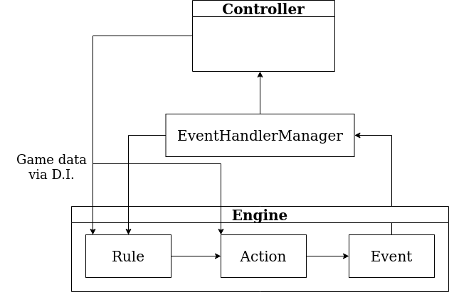

# Engine

## Rule-action-event loop



```java
public interface Rule {

  void registerEventHandlers(EventRegistrar registrar);
}

public interface Action {

  void runAction(ActionParams actionParams);
}

@FunctionalInterface
public interface EventEmitter {

  void emit(Event<?> event);
}
```

## Example classes

### Turn-based games

```java
public class TurnRule implements Rule {

  @Override
  public void registerEventHandlers(EventRegistrar registrar) {
    registrar.registerHandler(StartGameEvent.class, this::newTurn);
    registrar.registerHandler(StartTurnEvent.class, this::newTurn);
  }

  private void newTurn(EventHandlerParams<?> eventHandlerParams) {
    eventHandlerParams.actionQueue().add(10, new EventAction(new StartTurnEvent()));
  }
}
```

### Die-based movement

```java
public class DieRule implements Rule {

  private final Provider<RollDieAndMoveAction> dieActionProvider;

  @Inject
  public DieRule(Provider<RollDieAndMoveAction> dieActionProvider) {
    this.dieActionProvider = dieActionProvider;
  }

  @Override
  public void registerEventHandlers(EventRegistrar registrar) {
    registrar.registerHandler(StartTurnEvent.class, this::rollDie);
  }

  private void rollDie(EventHandlerParams<StartTurnEvent> eventHandlerParams) {
    eventHandlerParams.actionQueue().add(1, dieActionProvider.get());
  }
}
```

### Buying a tile in monopoly

```java
public class BuyTileRule implements Rule {

  @Override
  public void registerEventHandlers(EventRegistrar registrar) {
    registrar.registerHandler(TileLandedEvent.class, this::tryBuyProp);
  }

  private void tryBuyProp(EventHandlerParams<TileLandedEvent> eventHandlerParams) {
    Tile tile = eventHandlerParams.event().getLandedTile();
    BooleanAttribute ownedAttribute = BooleanAttribute.from(
        tile.getAttribute(BuyAction.OWNED_ATTRIBUTE));

    if (!ownedAttribute.getValue()) {
      eventHandlerParams.actionQueue().add(1, new BuyAction(tile));
    }
  }
}

public class BuyAction implements Action {

  public static final String OWNED_ATTRIBUTE = "owned";

  private final Tile tile;

  public BuyAction(Tile tile) {
    this.tile = tile;
  }

  @Override
  public void runAction(ActionParams actionParams) {
    actionParams.prompter().yesNoDialog(this::maybeBuy);
  }

  private void maybeBuy(boolean shouldBuy) {
    if (shouldBuy) {
      BooleanAttribute ownedAttribute = BooleanAttribute.from(tile.getAttribute(OWNED_ATTRIBUTE));
      ownedAttribute.setValue(true);
    }
  }
}
```
